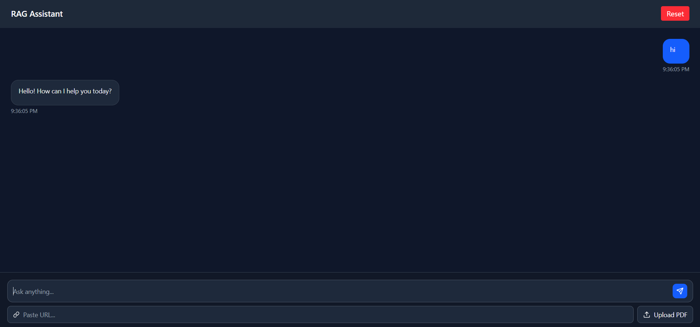
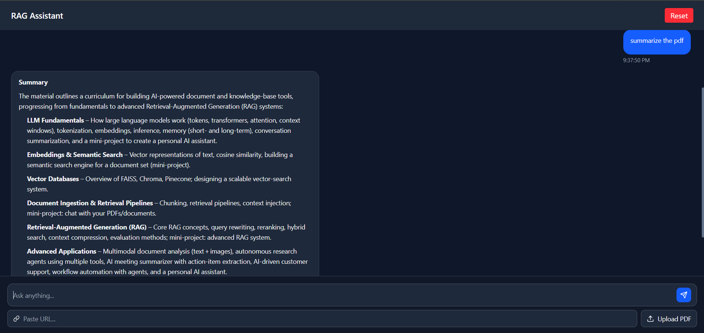

# 🚀 Multi-Source Conversational RAG Assistant

A full-stack **AI-powered assistant** that can understand and answer questions from multiple sources including:

* 📄 PDFs (file upload)
* 🌐 Web URLs
* ▶️ YouTube videos
* 💬 Normal conversational queries

Built with a **modern RAG (Retrieval-Augmented Generation) architecture**, this project combines document retrieval with conversational memory to deliver intelligent, context-aware responses.

---

## 🔥 Live Demo

👉 **Frontend (Vercel):** *Add your link here*
👉 **Backend (Render):** *Add your link here*

---

## 📸 Screenshots

### 🧠 Chat Interface



### 📄 Multi-Source Input (PDF + URL + Query)



---

## 🧠 Key Features

### ✅ Multi-Source RAG

* Upload PDF and query it
* Provide a URL and extract content
* Use YouTube links → auto transcript → Q&A
* Combine multiple sources in one session

---

### ✅ Conversational Memory

* Maintains chat history per session
* Supports follow-up queries like:

  > “Explain it simply”
* Uses memory + retrieved context together

---

### ✅ Smart Query Handling

* Detects input type (PDF / URL / YouTube / Text)
* Automatically routes to correct ingestion pipeline

---

### ✅ Streaming-like Responses

* Simulated real-time typing effect
* Improves user experience significantly

---

### ✅ Clean UI (React + Tailwind)

* Dark theme UI
* Markdown-rendered responses
* Table + bullet formatting support
* File upload preview
* URL input + query input in unified design

---

## 🏗️ Architecture

```plaintext
User Input
   ↓
Router (classify input type)
   ↓
Ingestion Pipeline
   ↓
Chunking + Embeddings (MiniLM)
   ↓
FAISS Vector Store
   ↓
Query Processing
   ↓
Retrieval (Top-K chunks)
   ↓
Conversation Memory
   ↓
LLM (Groq - LLaMA3 12B)
   ↓
Final Response
```

---

## ⚙️ Tech Stack

### 🔹 Backend

* FastAPI
* FAISS (Vector DB)
* Sentence Transformers (all-MiniLM-L6-v2)
* Groq API (LLaMA3-12B)
* PyPDF / Web Scraping / YouTube Transcript API

---

### 🔹 Frontend

* React (Vite)
* Tailwind CSS
* React Markdown (for formatting)
* Lucide Icons

---

## 📂 Project Structure

```plaintext
backend/
├── app/
│   ├── services/
│   │   ├── rag_service.py
│   │   ├── ingestion_service.py
│   │   ├── router_service.py
│   │   └── memory_service.py
│   ├── db/
│   │   └── vector_store.py
│   ├── loaders/
│   │   ├── pdf_loader.py
│   │   ├── url_loader.py
│   │   └── yt_loader.py
│   └── core/
│       └── groq_client.py

frontend/
├── src/
│   ├── components/
│   │   ├── ChatBox.jsx
│   │   ├── MessageBubble.jsx
│   │   ├── InputBar.jsx
│   │   ├── FileUpload.jsx
│   │   ├── UrlInput.jsx
│   │   └── TypingIndicator.jsx
│   └── hooks/
│       └── useChat.js
```

---

## 🧪 How It Works

1. User uploads or inputs data
2. System classifies input type
3. Data is ingested and chunked
4. Embeddings are created and stored in FAISS
5. Query is processed with conversation history
6. Relevant chunks are retrieved
7. LLM generates contextual response

---

## ⚠️ Challenges Solved

* Handling multiple input sources in one pipeline
* Managing conversational memory with RAG
* Fixing chunking overlap issues
* Rendering markdown (tables, bullets) properly
* Streaming-like UX without backend streaming

---

## 🚀 Future Improvements

* True streaming using SSE/WebSockets
* Per-session vector store isolation
* Authentication (user-based sessions)
* Deployment scaling (Docker + Kubernetes)
* Better ranking (re-ranking models)

---

## 🧑‍💻 Author

**Alok**
Aspiring Software Engineer | AI/ML Enthusiast

---

## ⭐ If you like this project

Give it a ⭐ on GitHub and feel free to contribute!
